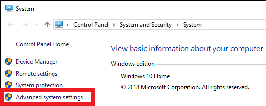
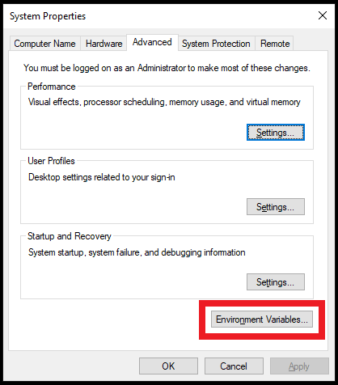
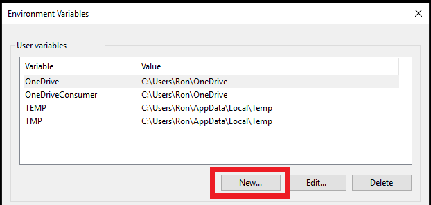
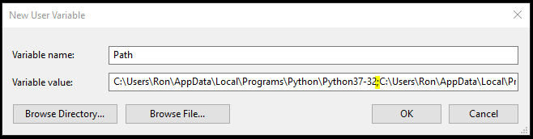
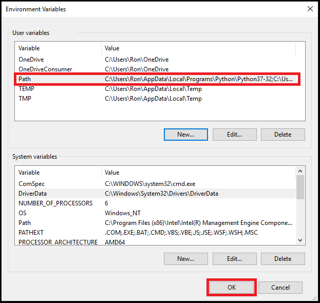

# MendVIP Integration Engineer Coding Challenge

The Challenge consists basically in retrieving XML data from a web API, treat it and convert it into a JSON string.

# Prerequisites

Python>=3.7.0

# Usage

Before using the script, make sure your python installation folder is included in your PATH system variables.

**For Windows:** If you're installing python now, make sure you select the option "Add Python to Path". 

If you already have python installed in your system and did not add your installation to the PATH system variable, then perform the following steps:

	a) Go to Control Panel -> System -> select "Advanced System Settings;

	b) On the System Properties settings, click on the button "Environment Variables"

	c) On the next panel, check your user variables list to see if you have a "Path" variable with your python folder, your python\scripts folder and your python\lib folder included. If not, click "New" to add the system variable to this list.

	d) Add "path" as variable name, and include your full python folder, your python\scripts folder and your python\lib folder in the value list, separated by ";". Click "OK".

	e)After adding the abovementioned parameters your "path" variable should be visible in the user variables list. Press the "OK" button to close the window and apply your changes.

**For Linux:** Add the following line at the top of the *mendvip_iecc.py* script: #!<pythonpath_environment_variable>.
For distributions like Linux, your pythonpath is usually something like */usr/lib/python3.7*.
To know what your pythonpath environment variable is, perform the following steps: 

	a) open a shell prompt and type: "python";

	b) type "import os";

	c) Type os.environ['PYTHONPATH'].split(os. pathsep) and press Enter. When you have a PYTHONPATH environment variable defined, you see a list of paths. Select the one you wish to use to run the script (remember that this script is tested for python 3.7. It won't work with python 2). 

** For MacOS **: Open a terminal and open your /etc/paths file with the command: "sudo nano /etc/paths". If your python folder, your python\lib folder and your python\scripts folder locations are not present, then add them to the file. Then press *CRTL-X* to quit and *Y* to commit your changes.  

**To use the script:** open a command prompt, navigate to your download folder and type: 
>python mendvip_iecc.py

# Notes

This is a very basic script i created for the challenge, since i didn't have much time for it. I will improve it with time, and scale it a bit, later on. Pull requests and contributions to the program are welcome as well.
There was also no need to set up an environment for this project, since all the modules and packages used are built-in packages in python. As long as you have a python 3 installation in your computer (preferably above version 3.7.2) you should be able to simply run the script with no problem. Added some small checks as well, but still need to test further for errors.  
 
 
